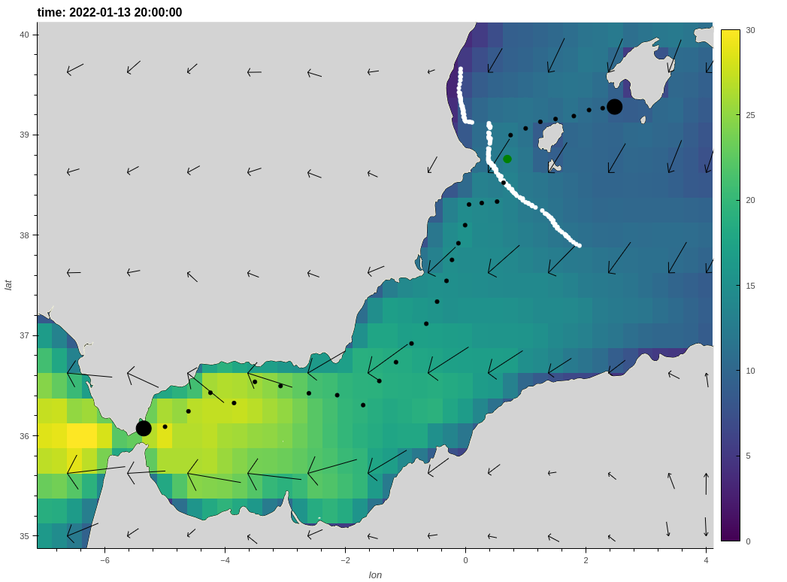

# weather_routing

[](https://github.com/peterm790/weather_routing/actions/workflows/python-app.yml)

### A pure python [weather routing](https://en.wikipedia.org/wiki/Weather_routing) algorithm.

Usage:

To perform a historical routing using a reanalysis model such as ERA5:

- First import packages:

```python
import intake
import xarray as xr
import zarr
import numpy as np

from isochronal_weather_router import weather_router
from polar import Polar
from visualize import visualize_3d
```

- Then clean and load the necessary subset of data into memory:

```python
catalog = intake.open_catalog('s3://esip-qhub-public/ecmwf/intake_catalog.yml')
ds = catalog['ERA5-Kerchunk-2020-2022'].to_dask()

ds.coords['lon'] = ((ds.coords['lon'] + 180) % 360) - 180
ds = ds.sortby(ds.lon)
ds = ds.sel(lat = slice(40,35)).sel(lon = slice(-7,4))
ds = ds.sel(time0 = slice('2022-01-13T12:00:00', '2022-01-20T12:00:00'))

u10 = ds.eastward_wind_at_10_metres
v10 = ds.northward_wind_at_10_metres
tws = np.sqrt(v10**2 + u10**2)
tws = tws*1.94384 #convert m/s to knots
twd = np.mod(180+np.rad2deg(np.arctan2(u10, v10)),360)
ds = tws.to_dataset(name = 'tws')
ds['twd'] = twd
ds = ds.load()
ds = ds.interpolate_na(dim = 'time0', method = 'linear') #some nans in this dataset not sure why
ds = ds.rename({'time0':'time'})
```
- Rather than the routing program attempt to guess the layout of the weather data, to simplify things the users needs to declare a `get_wind()` function

```python
def get_wind(t, lat, lon):
    tws_sel = ds.tws.sel(time = t, method = 'nearest')
    tws_sel = tws_sel.sel(lat = lat, lon = lon, method = 'nearest')
    twd_sel = ds.twd.sel(time = t, method = 'nearest')
    twd_sel = twd_sel.sel(lat = lat, lon = lon, method = 'nearest')
    return (np.float32(twd_sel.values), np.float32(tws_sel.values))
```

- Next we initialize the routing, declaring the `polar class`, `get_wind` function, list of `time_steps`, number of hours between `steps`, `start_point` and `end_point`. It is also possible to explicitly declare the bounds of the routing area in `point_validity_extent` this helps speed up this part of the programme. While `spread` adjusts the range of possible headings to consider, 180 would consider all possibilities but would slow the programme significantly. This routing is relatively short so we will use 140 degrees either side of the bearing to finish. `wake_lim` controls the degree of 'pruning' where 35 degrees is the size of the wake, behind each point. Please see this [article](http://www.tecepe.com.br/nav/vrtool/routing.htm) for a detailed description of pruning techniques.

```python
Palma = (39.430, 2.596)
Gibraltar = (-36.073, -5.354)

weatherrouter = weather_router(Polar('polar/volvo70.pol'), 
                               get_wind, 
                               time_steps = ds.time.values,
                               step = 1,
                               start_point = Palma,
                               end_point = Gibraltar,
                               point_validity_extent = [35,-5,40,4],
                               spread = 140,
                               wake_lim = 35,
                              )
```

- To run the routing simply call:

```python
weatherrouter.route()
```

- To get a table of statistics from the fastest route:

```python
weatherrouter.get_fastest_route()
```

```
+----+---------+------------+---------------------+----------+----------+-------------------------------------------+-------------------------------------------+-----------+----------+--------------+-----------------+----------------+
|    |     lat |        lon | time                |      twd |      tws | pos                                       | next_pos                                  |   heading |      twa |   boat_speed |   hours_elapsed |   days_elapsed |
+====+=========+============+=====================+==========+==========+===========================================+===========================================+===========+==========+==============+=================+================+
|  0 | 39.281  |  2.478     | 2022-01-13 12:00:00 |  26.131  |  7.17203 | (39.281, 2.478)                           | (39.26733007683735, 2.2786900146855307)   |   265     | -121.131 |         9.3  |               0 |      0         |
+----+---------+------------+---------------------+----------+----------+-------------------------------------------+-------------------------------------------+-----------+----------+--------------+-----------------+----------------+
|  1 | 39.2673 |  2.27869   | 2022-01-13 13:00:00 |  25.0675 |  8.31563 | (39.26733007683735, 2.2786900146855307)   | (39.24865599707216, 2.0519613060689865)   |   264     | -121.067 |        10.6  |               1 |      0.0416667 |
+----+---------+------------+---------------------+----------+----------+-------------------------------------------+-------------------------------------------+-----------+----------+--------------+-----------------+----------------+
|  2 | 39.2487 |  2.05196   | 2022-01-13 14:00:00 |  24.6236 |  9.62228 | (39.24865599707216, 2.0519613060689865)   | (39.18848697935533, 1.7991971114614662)   |   253     | -131.624 |        12.3  |               2 |      0.0833333 |
+----+---------+------------+---------------------+----------+----------+-------------------------------------------+-------------------------------------------+-----------+----------+--------------+-----------------+----------------+
|  3 | 39.1885 |  1.7992    | 2022-01-13 15:00:00 |  30.3027 | 10.8351  | (39.18848697935533, 1.7991971114614662)   | (39.159147147840955, 1.4951761951936726)  |   263     | -127.303 |        14.26 |               3 |      0.125     |
+----+---------+------------+---------------------+----------+----------+-------------------------------------------+-------------------------------------------+-----------+----------+--------------+-----------------+----------------+
|  4 | 39.1591 |  1.49518   | 2022-01-13 16:00:00 |  34.992  | 10.3808  | (39.159147147840955, 1.4951761951936726)  | (39.13128950950019, 1.2421527082136428)   |   262     | -132.992 |        11.9  |               4 |      0.166667  |
+----+---------+------------+---------------------+----------+----------+-------------------------------------------+-------------------------------------------+-----------+----------+--------------+-----------------+----------------+
|  5 | 39.1313 |  1.24215   | 2022-01-13 17:00:00 |  37.1169 | 11.2744  | (39.13128950950019, 1.2421527082136428)   | (39.0657480600496, 0.9979481189176773)    |   251     | -146.117 |        12.04 |               5 |      0.208333  |
+----+---------+------------+---------------------+----------+----------+-------------------------------------------+-------------------------------------------+-----------+----------+--------------+-----------------+----------------+
|  6 | 39.0657 |  0.997948  | 2022-01-13 18:00:00 |  41.3987 | 12.3089  | (39.0657480600496, 0.9979481189176773)    | (38.998458327451715, 0.7474916093107853)  |   251     | -150.399 |        12.36 |               6 |      0.25      |
+----+---------+------------+---------------------+----------+----------+-------------------------------------------+-------------------------------------------+-----------+----------+--------------+-----------------+----------------+
|  7 | 38.9985 |  0.747492  | 2022-01-13 19:00:00 |  43.8912 | 13.318   | (38.998458327451715, 0.7474916093107853)  | (38.76028337881922, 0.6936369469126931)   |   190     |  146.109 |        14.52 |               7 |      0.291667  |
+----+---------+------------+---------------------+----------+----------+-------------------------------------------+-------------------------------------------+-----------+----------+--------------+-----------------+----------------+
|  8 | 38.7603 |  0.693637  | 2022-01-13 20:00:00 |  46.8965 | 12.979   | (38.76028337881922, 0.6936369469126931)   | (38.523713872792506, 0.629368412983219)   |   192     |  145.103 |        14.52 |               8 |      0.333333  |
+----+---------+------------+---------------------+----------+----------+-------------------------------------------+-------------------------------------------+-----------+----------+--------------+-----------------+----------------+
|  9 | 38.5237 |  0.629368  | 2022-01-13 21:00:00 |  51.7796 | 12.3711  | (38.523713872792506, 0.629368412983219)   | (38.297119135186044, 0.5573879996903635)  |   194     |  142.22  |        14.02 |               9 |      0.375     |
+----+---------+------------+---------------------+----------+----------+-------------------------------------------+-------------------------------------------+-----------+----------+--------------+-----------------+----------------+
| 10 | 38.2971 |  0.557388  | 2022-01-13 22:00:00 |  53.1301 | 10.9341  | (38.297119135186044, 0.5573879996903635)  | (38.2549384987795, 0.3429448707500951)    |   256     | -157.13  |        10.42 |              10 |      0.416667  |
+----+---------+------------+---------------------+----------+----------+-------------------------------------------+-------------------------------------------+-----------+----------+--------------+-----------------+----------------+
| 11 | 38.2549 |  0.342945  | 2022-01-13 23:00:00 |  52.5946 | 10.4     | (38.2549384987795, 0.3429448707500951)    | (38.27538851881734, 0.09185797482892026)  |   276     | -136.595 |        11.9  |              11 |      0.458333  |
+----+---------+------------+---------------------+----------+----------+-------------------------------------------+-------------------------------------------+-----------+----------+--------------+-----------------+----------------+
| 12 | 38.2754 |  0.091858  | 2022-01-14 00:00:00 |  52.4716 | 10.5703  | (38.27538851881734, 0.09185797482892026)  | (38.06916017430898, 0.026551193382065744) |   194     |  141.528 |        12.76 |              12 |      0.5       |
+----+---------+------------+---------------------+----------+----------+-------------------------------------------+-------------------------------------------+-----------+----------+--------------+-----------------+----------------+
| 13 | 38.0692 |  0.0265512 | 2022-01-14 01:00:00 |  59.7887 | 11.1062  | (38.06916017430898, 0.026551193382065744) | (37.85715985182337, -0.05043354458284895) |   196     |  136.211 |        13.24 |              13 |      0.541667  |
+----+---------+------------+---------------------+----------+----------+-------------------------------------------+-------------------------------------------+-----------+----------+--------------+-----------------+----------------+
| 14 | 37.8572 | -0.0504335 | 2022-01-14 02:00:00 |  64.8671 | 10.8698  | (37.85715985182337, -0.05043354458284895) | (37.68004144498351, -0.16938630390243412) |   208     |  143.133 |        12.04 |              14 |      0.583333  |
+----+---------+------------+---------------------+----------+----------+-------------------------------------------+-------------------------------------------+-----------+----------+--------------+-----------------+----------------+
| 15 | 37.68   | -0.169386  | 2022-01-14 03:00:00 |  55.008  | 11.8638  | (37.68004144498351, -0.16938630390243412) | (37.513526335366, -0.2905416982275018)    |   210     |  154.992 |        11.54 |              15 |      0.625     |
+----+---------+------------+---------------------+----------+----------+-------------------------------------------+-------------------------------------------+-----------+----------+--------------+-----------------+----------------+
| 16 | 37.5135 | -0.290542  | 2022-01-14 04:00:00 |  64.4185 | 12.6612  | (37.513526335366, -0.2905416982275018)    | (37.306128432449356, -0.4471339557620966) |   211     |  146.582 |        14.52 |              16 |      0.666667  |
+----+---------+------------+---------------------+----------+----------+-------------------------------------------+-------------------------------------------+-----------+----------+--------------+-----------------+----------------+
| 17 | 37.3061 | -0.447134  | 2022-01-14 05:00:00 |  69.5582 | 14.262   | (37.306128432449356, -0.4471339557620966) | (37.08837232703034, -0.63113888218132)    |   214     |  144.442 |        15.76 |              17 |      0.708333  |
+----+---------+------------+---------------------+----------+----------+-------------------------------------------+-------------------------------------------+-----------+----------+--------------+-----------------+----------------+
| 18 | 37.0884 | -0.631139  | 2022-01-14 06:00:00 |  75.3236 | 15.824   | (37.08837232703034, -0.63113888218132)    | (36.89489326719905, -0.8813218884712812)  |   226     |  150.676 |        16.7  |              18 |      0.75      |
+----+---------+------------+---------------------+----------+----------+-------------------------------------------+-------------------------------------------+-----------+----------+--------------+-----------------+----------------+
| 19 | 36.8949 | -0.881322  | 2022-01-14 07:00:00 |  76.4875 | 16.1184  | (36.89489326719905, -0.8813218884712812)  | (36.650800793801174, -1.1187934660310397) |   218     |  141.513 |        18.58 |              19 |      0.791667  |
+----+---------+------------+---------------------+----------+----------+-------------------------------------------+-------------------------------------------+-----------+----------+--------------+-----------------+----------------+
| 20 | 36.6508 | -1.11879   | 2022-01-14 08:00:00 |  79.8457 | 16.5387  | (36.650800793801174, -1.1187934660310397) | (36.407156498919306, -1.381641246720945)  |   221     |  141.154 |        19.36 |              20 |      0.833333  |
+----+---------+------------+---------------------+----------+----------+-------------------------------------------+-------------------------------------------+-----------+----------+--------------+-----------------+----------------+
| 21 | 36.4072 | -1.38164   | 2022-01-14 09:00:00 |  76.8275 | 17.593   | (36.407156498919306, -1.381641246720945)  | (36.485484285184974, -1.7478182407226863) |   285     | -151.827 |        18.3  |              21 |      0.875     |
+----+---------+------------+---------------------+----------+----------+-------------------------------------------+-------------------------------------------+-----------+----------+--------------+-----------------+----------------+
| 22 | 36.4855 | -1.74782   | 2022-01-14 10:00:00 |  61.5571 | 19.8962  | (36.485484285184974, -1.7478182407226863) | (36.55982037165094, -2.1879453098571084)  |   282     | -139.557 |        21.7  |              22 |      0.916667  |
+----+---------+------------+---------------------+----------+----------+-------------------------------------------+-------------------------------------------+-----------+----------+--------------+-----------------+----------------+
| 23 | 36.5598 | -2.18795   | 2022-01-14 11:00:00 |  51.8091 | 23.1865  | (36.55982037165094, -2.1879453098571084)  | (36.55888879569992, -2.660294080942467)   |   270     | -141.809 |        22.78 |              23 |      0.958333  |
+----+---------+------------+---------------------+----------+----------+-------------------------------------------+-------------------------------------------+-----------+----------+--------------+-----------------+----------------+
| 24 | 36.5589 | -2.66029   | 2022-01-14 12:00:00 |  59.7654 | 22.9208  | (36.55888879569992, -2.660294080942467)   | (36.545786638579365, -3.098709902234455)  |   268     | -151.765 |        21.16 |              24 |      1         |
+----+---------+------------+---------------------+----------+----------+-------------------------------------------+-------------------------------------------+-----------+----------+--------------+-----------------+----------------+
| 25 | 36.5458 | -3.09871   | 2022-01-14 13:00:00 |  67.7241 | 21.7938  | (36.545786638579365, -3.098709902234455)  | (36.58113030224537, -3.5265257789088165)  |   276     | -151.724 |        20.74 |              25 |      1.04167   |
+----+---------+------------+---------------------+----------+----------+-------------------------------------------+-------------------------------------------+-----------+----------+--------------+-----------------+----------------+
| 26 | 36.5811 | -3.52653   | 2022-01-14 14:00:00 |  85.8653 | 20.22    | (36.58113030224537, -3.5265257789088165)  | (36.36054056375838, -3.864060275252128)   |   231     |  145.135 |        21    |              26 |      1.08333   |
+----+---------+------------+---------------------+----------+----------+-------------------------------------------+-------------------------------------------+-----------+----------+--------------+-----------------+----------------+
| 27 | 36.3605 | -3.86406   | 2022-01-14 15:00:00 |  83.1818 | 22.5134  | (36.36054056375838, -3.864060275252128)   | (36.451516679080484, -4.261350791210687)  |   286     | -157.182 |        19.96 |              27 |      1.125     |
+----+---------+------------+---------------------+----------+----------+-------------------------------------------+-------------------------------------------+-----------+----------+--------------+-----------------+----------------+
| 28 | 36.4515 | -4.26135   | 2022-01-14 16:00:00 | 102.529  | 17.9213  | (36.451516679080484, -4.261350791210687)  | (36.26156409940817, -4.623066404221441)   |   237     |  134.471 |        20.88 |              28 |      1.16667   |
+----+---------+------------+---------------------+----------+----------+-------------------------------------------+-------------------------------------------+-----------+----------+--------------+-----------------+----------------+
| 29 | 36.2616 | -4.62307   | 2022-01-14 17:00:00 |  97.386  | 19.8461  | (36.26156409940817, -4.623066404221441)   | (36.09675157410734, -5.005262515337476)   |   242     |  144.614 |        21    |              29 |      1.20833   |
+----+---------+------------+---------------------+----------+----------+-------------------------------------------+-------------------------------------------+-----------+----------+--------------+-----------------+----------------+
| 30 | 36.0968 | -5.00526   | 2022-01-14 18:00:00 | 103.241  | 21.2173  | (36.09675157410734, -5.005262515337476)   | (36.073, -5.354)                          |   265.285 |  162.045 |        18.02 |              30 |      1.25      |
+----+---------+------------+---------------------+----------+----------+-------------------------------------------+-------------------------------------------+-----------+----------+--------------+-----------------+----------------+
```

- And to visualise the routing call (this util is rather buggy):

```
visualize_3d(ds,Palma, Gibraltar, weatherrouter.get_isochrones(), weatherrouter.get_fastest_route(stats = False))
```




An interactive example of the above plot is available [here](https://petemarsh.com/readme_example)
